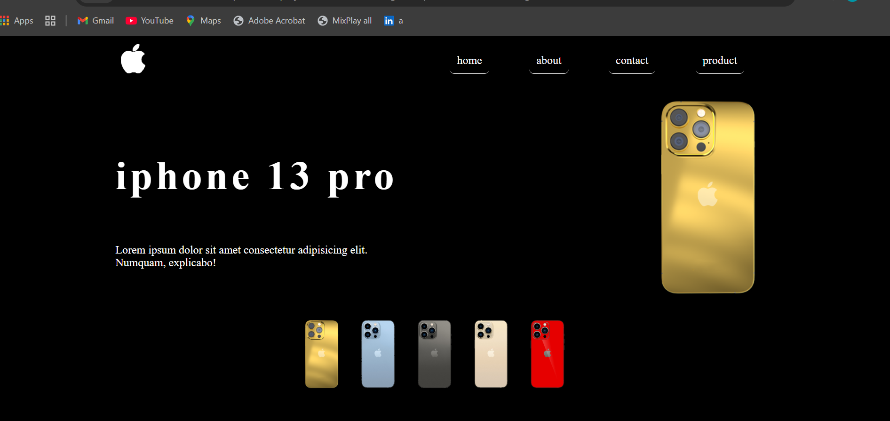
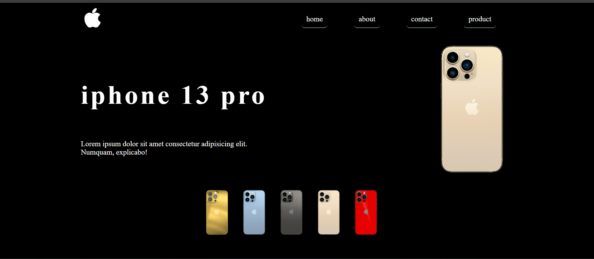
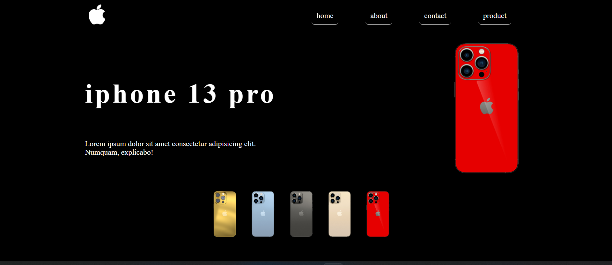
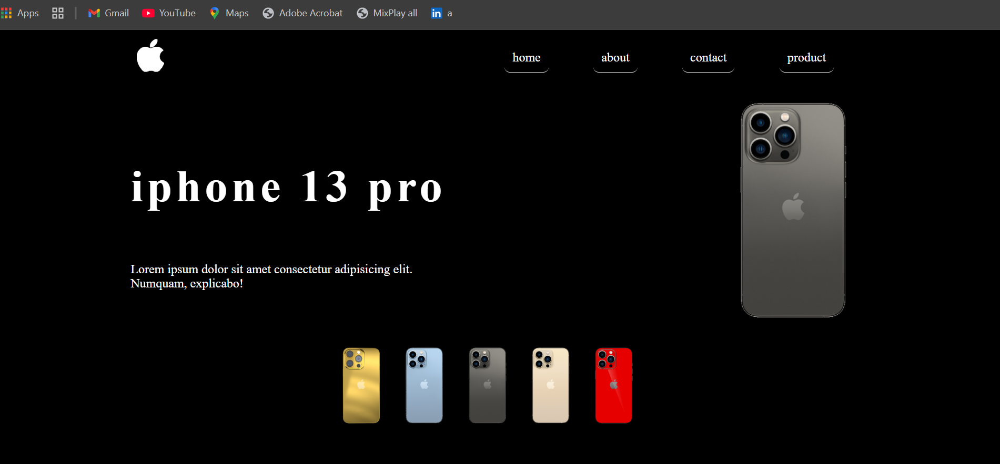

# iPhone Landing Page 

A clean and responsive landing page for iPhone products. Built with HTML, CSS, and JavaScript, this project showcases featured iPhones with a modern design and smooth animations.

## About
This project is a simple yet elegant landing page for iPhone models. It includes:

- Hero section highlighting the latest iPhone
- Product showcase with images and specifications
- Responsive design for mobile, tablet, and desktop
- Smooth scroll animations for better user experience
- Clean and modern UI design using CSS and optional animations

Perfect for learning HTML, CSS, JavaScript, and building visually appealing product landing pages.

## Screenshots
Screenshots of the landing page:







## Technologies Used
- HTML5
- CSS3
- JavaScript (Vanilla)
- [Optional: Bootstrap or Tailwind for styling]

## How to Run
1. Clone the repository:
   ```bash
   git clone https://github.com/yourusername/iphone-website.git
